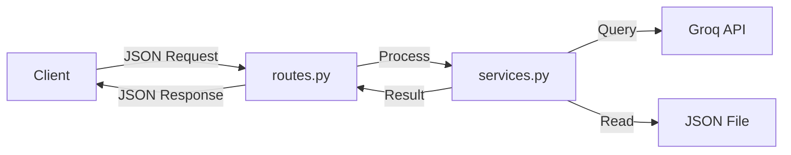

# Backend Architecture

The application uses a **Flask (Python)** backend acting as a REST API and an orchestration layer for AI services.

## 1. Directory Structure (`backend/`)

| File/Folder | Type | Purpose |
| :--- | :--- | :--- |
| **app.py** | Entry Point | Usage for cloud deployments (Gunicorn). |
| **app/routes.py** | Controller | Defines API endpoints (`/api/...`) and handles HTTP requests. |
| **app/services.py** | Service | Contains core business logic, data processing, and VLM integration. |
| **groq_service.py** | AI Service | Specialized wrapper for Groq API (Text & Vision models). |
| **india_epidemiology_data.json** | Data Store | Static source of truth for disease statistics. |

## 2. Data Flow Architecture

### **Request Lifecycle**

## 3. Key Components

### A. The Controller (`routes.py`)
Acts as the "traffic cop". It accepts requests, validates inputs (e.g., checks if a file is uploaded), and delegates work to the services.
*   **Example Endpoint**: `/api/analyze-report`
*   **Method**: `POST`
*   **Function**: Transforms image to Base64 -> Calls VLM Service -> Returns Analysis.

### B. The AI Service (`groq_service.py`)
Encapsulates all interactions with Large Language Models.
*   **Singleton Pattern**: Initialized once (`GroqHealthAssistant`) to manage connections efficiently.
*   **System Prompts**: Dynamically injects context (Persona, Date, Safety Rules) into model calls.
*   **Models**:
    *   **Llama-3.1**: For fast, conversational text responses.
    *   **Llama-4-Scout**: For analyzing complex medical images.

### C. Data Handling
*   **Static Data**: To ensure reliability and speed, core health statistics are served from `india_epidemiology_data.json` rather than a live scraping process, ensuring validated data availability.
*   **NoSQL Database**: User-specific data (chat history, persistent records) is offloaded to Firebase, keeping the Flask backend stateless.

